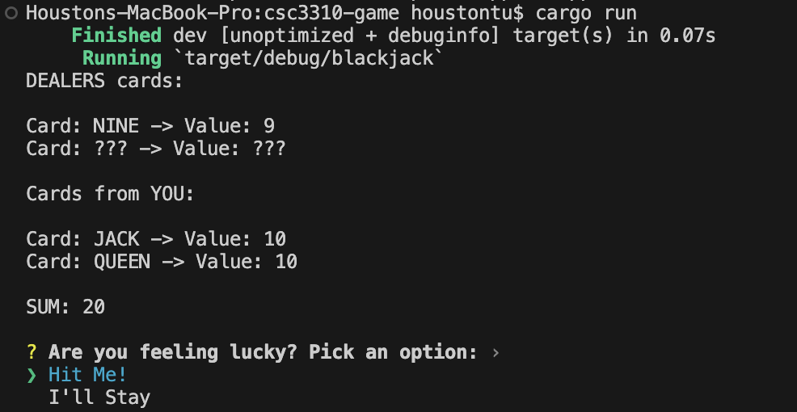
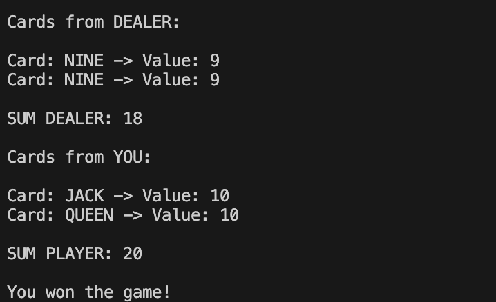

# BlackJack
## Description of the game
A simple BlackJack game in the works that can be run from within the terminal.

Beat the dealer by getting as close as you can to 21!

## How to play
Make sure you have rust and cargo installed
- Fork this repo into your desired directory
- Run 'cargo run' within your IDE's terminal or within the root directory.
## Screenshots of the game working

The first 4 lines represent the dealer's randomized hand.
The last 4 lines represent your hand.
