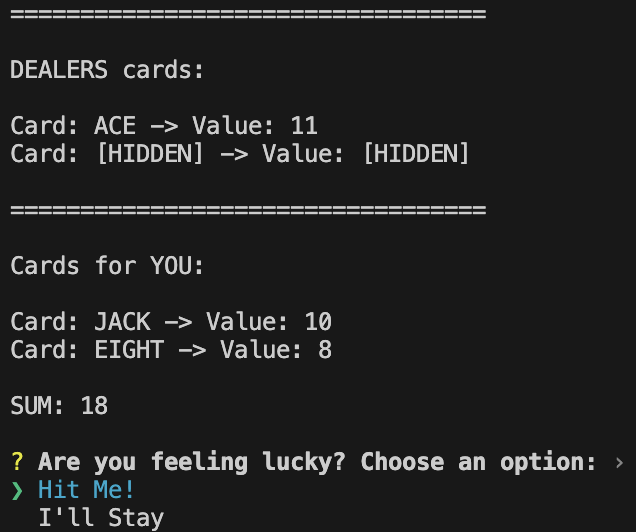
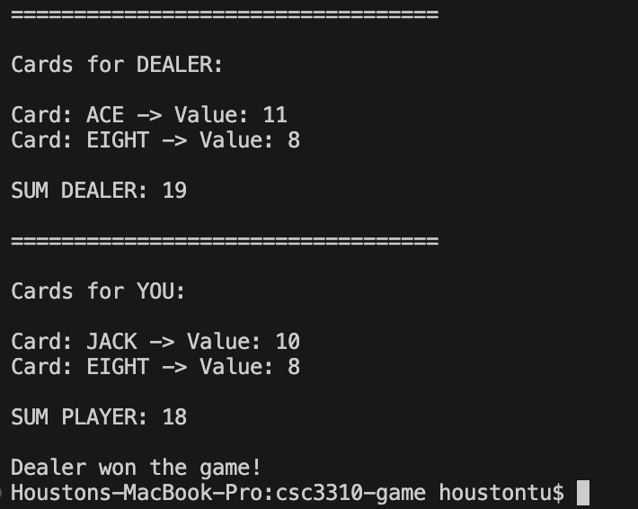

# BlackJack
## Description of the game
A simple BlackJack game in the works that can be run from within the terminal.

Beat the dealer by getting as close as you can to 21!

## How to play
Make sure you have [Rust](https://www.rust-lang.org) and [Cargo](https://doc.rust-lang.org/cargo/getting-started/installation.html) installed.
- Fork this repo into your desired directory
- To play this game, run:
```
cargo run
```
within your IDE's terminal or within the root directory.

## Screenshots of the game working (sample gameplay)
After 'cargo run':




After you "stayed":



In this case, you hit once and remained at 18. The dealer revealed they had 19. You lose.

